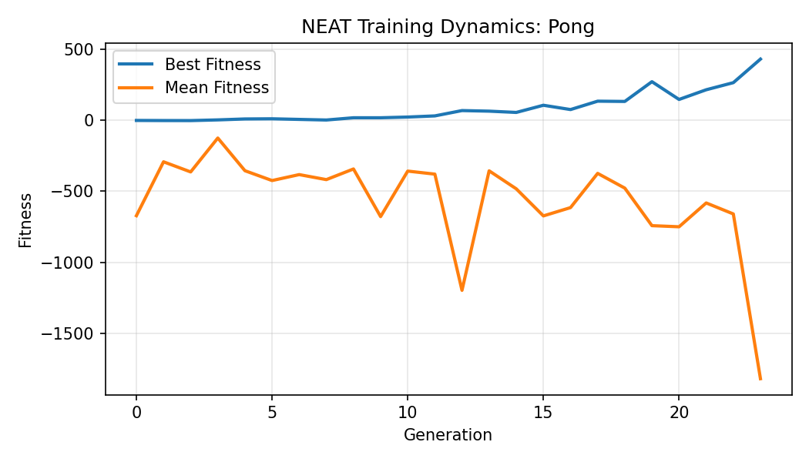
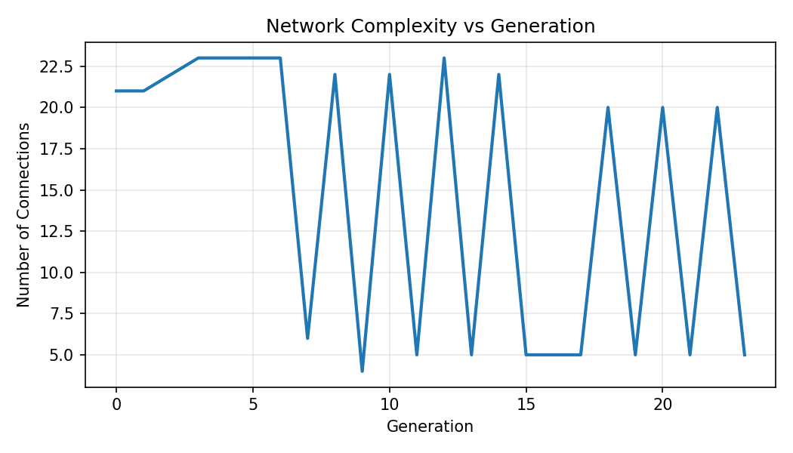

# 🧠 Neuroevolutionary Pong with NEAT

## Overview
This project explores **neuroevolution** as an alternative to gradient-based learning by evolving neural networks to play **Pong** using **NEAT (NeuroEvolution of Augmenting Topologies)**.

The emphasis is on **learning dynamics, optimization behavior, and emergence of strategy**, rather than maximizing game score or visual polish.

---

## Motivation
Most modern AI systems rely on backpropagation and fixed architectures. Neuroevolution instead learns through **population dynamics and selection**, evolving both **weights and network structure**.

Pong provides a minimal yet non-trivial environment to study how coordinated behavior emerges under evolutionary pressure.

---

## Approach

### Algorithm
- NEAT (evolves topology + weights)

### State Inputs
- Paddle position  
- Relative paddle–ball distance  
- Ball position  

### Action Space
- Stay  
- Move up  
- Move down  

### Fitness Signal
- Rally length (ball hits)  
- Survival time  

### Training
- Population-based self-play across generations

---

## Results
Agents consistently learn to track and return the ball, with increasingly stable and anticipatory behavior emerging over generations — without any hard-coded strategy.

### Training Dynamics



*Best and mean fitness across generations, showing population-level learning rather than isolated high-performing agents.*

- Rising **mean fitness** → stable evolutionary improvement  
- Faster gains in **best fitness** → exploration + selection  
- Plateaus → convergence limits and fitness shaping effects  

This visualization captures **optimization behavior**, not just final performance.

### Network Complexity



*Growth in network connectivity over generations, indicating that structural complexity increases only when beneficial for performance.*


---

## Limitations
- Computationally expensive compared to gradient-based RL  
- High variance across random seeds  
- Fitness design strongly influences convergence behavior  

---

## Future Work
- Compare NEAT against policy-gradient RL on the same environment  
- Analyze robustness under noise and partial observability  
- Study network complexity growth vs performance  

---

## Tech Stack
- Python  
- NEAT-Python  
- Pygame  
- Matplotlib  

---

## Why This Matters
This project reflects an interest in how learning and intelligence emerge from simple rules, and how different optimization paradigms shape behavior, core questions in AI research beyond any single algorithm.
  This project prioritizes insight into learning dynamics over polished gameplay.
---

## Run
```bash
pip install neat-python pygame matplotlib
python main.py


